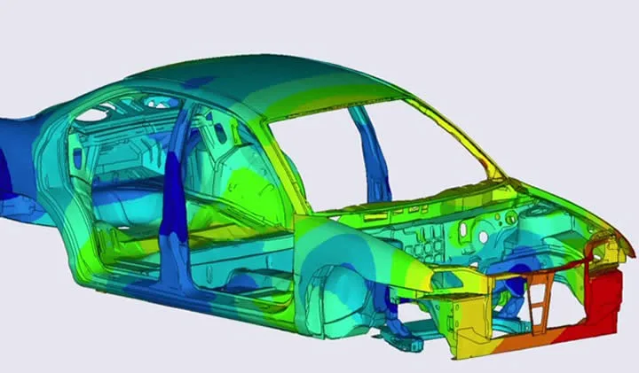

<!DOCTYPE HTML>
<!--
	Arcana by HTML5 UP
	html5up.net | @ajlkn
	Free for personal and commercial use under the CCA 3.0 license (html5up.net/license)
-->
<html>
	<head>
		<title>Mouzhi Othmane</title>
		<meta charset="utf-8" />
		<meta name="viewport" content="width=device-width, initial-scale=1, user-scalable=no" />
		<link rel="stylesheet" href="assets/css/main.css" />
	</head>
	<body class="is-preload">
		

			<!-- Header -->
				

					<!-- Logo -->
						<h1><a href="index.html" id="logo"> Modelumis <em>by Mouzhi Othmane</em></a></h1>

					<!-- Nav -->
						<nav id="nav">
							<ul>
								<li class="current"><a href="index.html">Home</a></li>
								<li>
									<a href="#">Models</a>
									<ul>
										<li><a href="Mathematic.html">Mathematic</a></li>
										<li><a href="Sciences_and_engineering.html">Sciences and engineering</a></li>
							
										<li>
											<a href="Physics.html">Physics</a>
											<ul>
												<li><a href="Solid_mechanics.html">Solid Mechanic</a></li>
												<li><a href="Fluid_mechanics.html">Fluid Mechanic</a></li>
												<li><a href="MHD.html">MHD-Magnetohydrodynamic</a></li>
												<li><a href="Electrostatic.html">Electrostatic</a></li>
												<li><a href="Signal_and_filter.html">Signal and filter</a></li>
											</ul>
										</li>
										<li><a href="#">Other</a></li>
									</ul>
								</li>
								<li><a href="#">Methods</a></li>
								<!--
								<li><a href="right-sidebar.html">Right Sidebar</a></li>
								<li><a href="two-sidebar.html">Two Sidebar</a></li>
								<li><a href="no-sidebar.html">No Sidebar</a></li>
							-->
							</ul>
						</nav>

				

			<!-- Banner -->
				<section id="banner">
					<header>
						<h2>Modelumis : <em> How to modelise and simulate anything</em></h2>
						<a href="#" class="button">Learn More</a>
					</header>
				</section>

			<!-- Highlights -->
				<section class="wrapper style1">
					

						

							<section class="col-4 col-12-narrower">
								

									<i class="icon solid major fa fa-university"></i>
									<h3>Tutorials</h3>
									
With Modelimus, you will find you own way to build your simulation

								

							</section>
							<section class="col-4 col-12-narrower">
								

									<i class="icon solid major fa-pencil-alt"></i>
									<h3>Paper-pencil</h3>
									
That's very relevant. When you start something new, take a piece of sheet and write how the algorithm you will write is going to worok in order to have control when you are coding</strong>

								

							</section>
							<section class="col-4 col-12-narrower">
								

									<i class="icon solid major fa-paper-plane"></i>
									<h3>Contact</h3>
									
If you have any question, don't hesitate to send me a message

								

							</section>
						

					

				</section>

			<!-- Gigantic Heading -->
				<section class="wrapper style2">
					

						<header class="major">
							<h2>Why do we need simulations ?</h2>
							
Because without simulation, the number of test would explose

						</header>
					

				</section>

			<!-- Posts -->
				<section class="wrapper style1">
					

						

							<section class="col-6 col-12-narrower">
								

									
									

										<h3>Theory</h3>
										
Most of problems do not admit analytical solutions. So, it is difficult to approach the solution in any point. Sometimes, we can just know the behavior of the solutions at boundaries. In solid mechanics equation, there is rarely a analytical solution. The system is to complicate to modelise theoretically.

										
									

								

							</section>
							<section class="col-6 col-12-narrower">
								

									
									

										<h3>Experiment</h3>
										
In most cases, experiments are:		Difficult or impossible to perform, too dangerous to implement, expensive and time consuming, blind and too many parameters to control

										
									

								

							</section>
						

						

							<section class="col-6 col-12-narrower">
								

									
									

										<h3>Simulation</h3>
										
It is a powerful tool. It can replace experiments, provoke experiments, ecplain and understand experiments, complete the theory and experiments.

										
									

								

							</section>
							<section class="col-6 col-12-narrower">
								

									
									

										<h3>Car crash</h3>
										
Let's take the example of a car crash. Guess we are building a car. We need to assure that the car respect barely automotive standards. So, we have to make that the car is safe. So, we have to make a lot of crash test with this car. However, the director impose us to not use more than 5 cars. The solid mechanics dynamic equations will not have analytical solutions. Thus, we have to use simulations to make sure that the car is able to enter in the market.

										
									

								

							</section>
						

					

				</section>

			<!-- CTA -->
				<section id="cta" class="wrapper style3">
					

						<header>
							<h2>Do you want more ?</h2>
						</header>
					

				</section>

			<!-- Footer -->
				

					

						

							<section class="col-3 col-6-narrower col-12-mobilep">
								<h3>Links to Stuff</h3>
								<ul class="links">
									<li><a href="https://www.f-legrand.fr/scidoc/">Applied Informatic in Physics</a></li>
									<li><a href="http://www.tangentex.com/">Initiation to numerical physic</a></li>
									<li><a href="https://www.physique.usherbrooke.ca/pages/sites/default/files/PHQ404_0.pdf">Thesis introducing to numerical methods</a></li>
									<!-- Commentaires

									<li><a href="#">Rutrum accumsan dolor</a></li>
									<li><a href="#">Mattis rutrum accumsan</a></li>
									<li><a href="#">Suspendisse varius nibh</a></li>
									<li><a href="#">Sed et dapibus mattis</a></li>
									-->
								</ul>
							</section>
							<section class="col-3 col-6-narrower col-12-mobilep">
								<h3>More Links to Stuff</h3>
								<ul class="links">
									<li><a href="https://openclassrooms.com/fr/courses/1894236-programmez-avec-le-langage-c">Learn C++ with Openclassroom</a></li>
									<li><a href="https://cel.archives-ouvertes.fr/cel-00573975/document">Thesis Scientific calculus with C++</a></li>
									<li><a href="https://moodle.umontpellier.fr/pluginfile.php/378656/mod_resource/content/42/Modelisation_Simulation_Notes-19.pdf">Methods and limits of numerical methods with examples</a></li>
									<!--
									<li><a href="#">Sed et dapibus quis</a></li>
									<li><a href="#">Rutrum amet varius</a></li>
									-->
								</ul>
							</section>
							<!--
							<section class="col-6 col-12-narrower">
								<h3>Get In Touch</h3>
								<form>
									

										

											<input type="text" name="name" id="name" placeholder="Name" />
										

										

											<input type="email" name="email" id="email" placeholder="Email" />
										

										

											<textarea name="message" id="message" placeholder="Message" rows="5"></textarea>
										

										

											<ul class="actions">
												<li><input type="submit" class="button alt" value="Send Message" /></li>
											</ul>
										

									

								</form>
							</section>
						-->
						

					

					<!-- Icons -->
						<ul class="icons">
							<!--Attention à changer
							<li><a href="https://twitter.com/Othmanedu77" class="icon brands fa-twitter">Twitter</a></li>-->
							<li><a href="https://github.com/othmanemouzhi/Sciences_Python_C-" class="icon brands fa-github">GitHub</a></li>
							<li><a href="https://www.linkedin.com/in/othmane-mouzhi-906634135?lipi=urn%3Ali%3Apage%3Ad_flagship3_profile_view_base_contact_details%3Bxx3YZEi4TYSm2eFNrHMHdw%3D%3D" class="icon brands fa-linkedin-in">LinkedIn</a></li>
							<!--
							<li><a href="#" class="icon brands fa-google-plus-g">Google+</a></li>
						-->
						</ul>

				

		

		<!-- Scripts -->
			
			
			
			
			
			

	</body>
</html>
